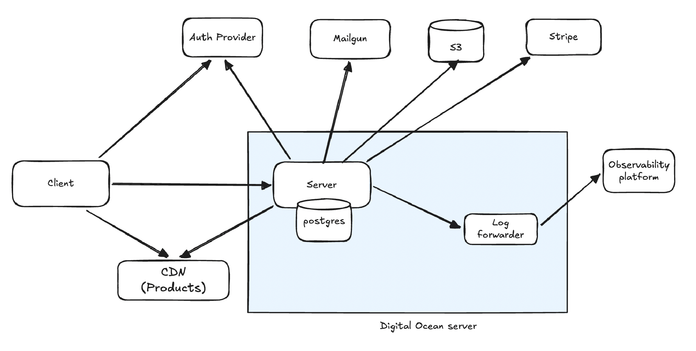

# Keto Granola server 
Go server for keto granola e-commerce platform using Echo for HTTP routing, PostgreSQL for data persistence, and sqlc for type-safe database queries.

## App architecture


## Development

### Prerequisite files:
- .env

### Setup:
```
make dep
```

### Run with docker:
```
docker-compose up -d
```

### Run without docker:
```
docker-compose up -d postgres # run only postgres via docker
make run
```

### Lint:
```
make lint
```

### Tests:
```
make test
```

- Running unit tests only:
`make test/unit`

- Running e2e tests only:
`make test/e2e`

### Generate db queries:
```
make sqlc
```

### Create a db migration:
```
make migrate/create name=<migration_name>
```

### Generate mocks:
```
make mocks
```
